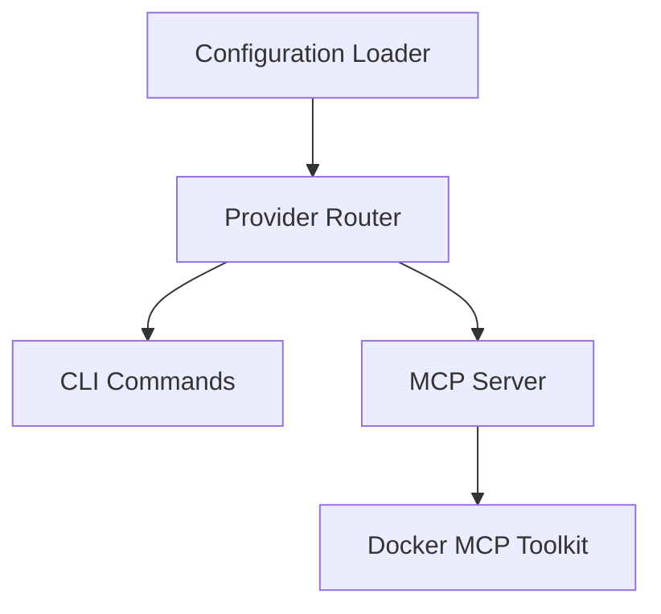

# Project Roadmap Workflow

## Purpose

Create an implementation roadmap for a project based on use cases and specs.

**Input**: Use cases + Specs  
**Output**: Phased implementation roadmap in `docs/projects/`

## Step 1: Identify the Project

Ask the user:
- **Project name**: What are we building? (e.g., "AnyGPT TS Monorepo", "AnyGPT Go Implementation")
- **Project type**: Greenfield (new) or existing codebase?

## Step 2: Review Available Specs

List all specs that define what needs to be built:

```bash
find docs/products/[product-name]/specs -name "*.md" -type f | grep -v README
```

For each spec, note:
- Component/command name
- Related use case
- What it depends on

## Step 3: Assess Current State

Ask the user: **"Which specs are already implemented?"**

For existing projects:
- ✅ Fully implemented
- 🔄 Partially implemented
- ❌ Not implemented

For greenfield projects:
- Everything is ❌ Not implemented

## Step 4: Identify Dependencies

For each unimplemented spec, determine:

**Technical dependencies**:
- What components must exist first?
- Example: "Benchmark Command depends on Provider Router"

**Logical sequence**:
- What's the foundation? (build first)
- What's advanced? (build later)

**Common dependency order**:
1. **Foundation**: Configuration Loader, Provider Router, Connectors
2. **Core**: Basic CLI commands, MCP Server
3. **Advanced**: Complex commands, integrations

## Step 5: Create High-Level Architecture

Before diving into features, create high-level architecture document:

**Architecture document must include**:
- **High-level diagram**: Show all major components and their relationships
- **Component overview**: What each component does
- **Data flow diagrams**: How requests flow through the system
- **Module structure**: How packages/modules are organized
- **Key design decisions**: Architecture patterns, technology choices, rationale
- **Extension points**: How to add new features without modifying core
- **Future extensions**: Potential enhancements and growth areas

**Output**: `docs/projects/[project-name]/architecture.md`

**Purpose**: 
- Provides big picture before feature details
- Links all planned features together
- Serves as reference for all feature designs
- Documents architectural decisions

**Optional**: Architecture Decision Records (ADRs) in `docs/projects/[project-name]/decisions/`

## Step 6: Create Project README

Create project overview document:

**Output**: `docs/projects/[project-name]/README.md`

**README must include**:
- **Project name and description**: What is this project?
- **Technology stack**: Languages, frameworks, tools
- **Status**: Planning, In Progress, Complete
- **Documentation links**: Architecture, Roadmap, Features
- **Quick start**: How to get started with this project
- **Structure**: Brief overview of project organization

**Template**:
```markdown
# [Project Name]

**Status**: Planning | In Progress | Complete  
**Technology**: [e.g., TypeScript, Node.js, Nx]

## Overview

[Brief description of what this project implements]

## Documentation

- [Architecture](./architecture.md) - System design and components
- [Roadmap](./roadmap.md) - Feature list and implementation phases
- [Features](./features/) - Individual feature designs

## Status

- **Phase 1**: ❌ Not Started (0/N features)
- **Phase 2**: ❌ Not Started (0/N features)
- **Phase 3**: ❌ Not Started (0/N features)
- **Phase 4**: ❌ Not Started (0/N features)

## Quick Start

[How to start working on this project]

## Structure

\`\`\`
[project-name]/
├── architecture.md    # System design
├── roadmap.md        # Feature roadmap
└── features/         # Feature designs
    ├── 1-1-[name]/
    ├── 1-2-[name]/
    └── ...
\`\`\`
```

## Step 7: Create Phased Roadmap

Organize into phases based on dependencies:

**Phase structure**:
- **Phase 0**: Technical Design (before any implementation)
- **Phase 1**: Foundation (blocks everything else)
- **Phase 2**: Core features (depends on foundation)
- **Phase 3**: Advanced features (depends on core)
- **Phase 4**: Integrations (depends on advanced)

## Step 8: Define Test Scenarios (TDD)

For each unimplemented item, define test scenarios **before** implementation:

**Test-Driven Development approach**:
1. Write test scenarios from spec
2. Implement tests (they fail initially)
3. Implement feature to make tests pass
4. Refactor with confidence

**Test categories**:
- **Unit tests**: Individual functions/classes
- **Integration tests**: Component interactions
- **E2E tests**: Full user workflows
- **Contract tests**: Spec compliance

**Example test scenarios**:
```markdown
### Benchmark Command - Test Scenarios

#### Unit Tests
- [ ] Parse command arguments correctly
- [ ] Validate model names
- [ ] Handle invalid arguments with proper exit codes

#### Integration Tests
- [ ] Execute benchmark with single model
- [ ] Execute benchmark with multiple models
- [ ] Collect metrics correctly
- [ ] Format output as table
- [ ] Format output as JSON
- [ ] Format output as CSV

#### E2E Tests
- [ ] Run: `anygpt benchmark --models gpt-4o,claude --prompt "test"`
- [ ] Verify output matches spec format
- [ ] Verify exit code is 0 on success
- [ ] Verify exit code is 1 on invalid args

#### Error Scenarios
- [ ] Invalid model name returns proper error
- [ ] Missing required argument shows usage
- [ ] API failure is handled gracefully
```

## Step 10: Define Acceptance Criteria

For each item, specify when it's done:

**Acceptance criteria**:
- All test scenarios pass ✅
- Spec is satisfied (all requirements met)
- Examples from spec execute successfully
- Code coverage meets threshold (e.g., 80%)

**Example**:
```markdown
### Benchmark Command - Acceptance
- [ ] All 15 test scenarios pass
- [ ] Command syntax matches spec exactly
- [ ] All output formats work as specified
- [ ] All exit codes match spec
- [ ] All error messages match spec
- [ ] Examples from spec execute successfully
- [ ] Code coverage > 80%
```

## Step 10: Generate Project Documentation

Create project folder structure:
```bash
mkdir -p docs/projects/[project-name]/{decisions,features}
```

Create files:
- `docs/projects/[project-name]/roadmap.md` - Implementation phases and feature list
- `docs/projects/[project-name]/architecture.md` - High-level system architecture
- `docs/projects/[project-name]/features/` - Per-feature documentation (use `/feature` workflow)
- `docs/projects/[project-name]/decisions/` - ADRs (optional)

**Note**: Use `/feature` workflow to create detailed feature documentation

**Template**:

```markdown
# [Project Name] Roadmap

**Generated**: [Date]  
**Based on**: Use cases and specs in docs/product/

## Project Overview

[Brief description of what we're building]

## Implementation Status

### ✅ Implemented
[List of completed specs with links]

### 🔄 In Progress
[List of partially implemented specs]

### ❌ Not Implemented
[List of specs to be built]

## Features

Features are implemented using the `/feature` workflow. Each feature gets its own folder:

```
features/
├── benchmark-command/
├── chat-command/
├── conversation-command/
├── config-loader/
├── provider-router/
└── mcp-server/
```

See individual feature folders for detailed design, tests, and implementation status.

## Roadmap Phases

### Phase 0: Technical Design
**Goal**: Make architectural decisions before implementation

- **Technical Design Document**
  - Architecture patterns
  - Technology choices
  - Module structure
  - Testing strategy
  - See: design.md

### Phase 1: Foundation
**Goal**: Build core infrastructure that everything depends on

- **[Component Name]**
  - Spec: [link to spec]
  - Use Case: [link to use case]
  - Dependencies: None (foundation)
  - Test Scenarios: [link to test scenarios]
  - Acceptance: [criteria]

### Phase 2: Core Features
**Goal**: Implement essential functionality

- **[Feature Name]**
  - Spec: [link]
  - Use Case: [link]
  - Dependencies: [list from Phase 1]
  - Acceptance: [criteria]

### Phase 3: Advanced Features
**Goal**: Add sophisticated capabilities

[Same structure]

### Phase 4: Integrations
**Goal**: External integrations and tooling

[Same structure]

## Dependency Graph



## Next Steps

1. Start with Phase 1
2. Complete all Phase 1 items before moving to Phase 2
3. Use specs as implementation guide
4. Update this roadmap as work progresses
```

## Quality Checklist

Before finalizing roadmap:
- [ ] All specs are accounted for
- [ ] Dependencies are clearly identified
- [ ] Phases are logically ordered
- [ ] Acceptance criteria are specific
- [ ] Links to specs and use cases work
- [ ] Dependency graph is accurate

## Example Interaction

**AI**: "I found 7 specs. Which are already implemented in AnyGPT TS Monorepo?"

**User**: "Provider Router, Config Loader, CLI Chat, CLI Conversation, CLI Config, MCP Server are done."

**AI**: "Got it. Creating roadmap for remaining items: Benchmark Command and Docker MCP Toolkit..."

**Output**: `docs/projects/anygpt-ts/roadmap.md` with phased plan

## Architecture Document Template

Create: `docs/projects/[project-name]/architecture.md`

```markdown
# [Project Name] Architecture

**Last Updated**: [Date]

## Architecture Overview

[High-level architecture diagram and description]

## Design Decisions

### Module Structure
- How packages/modules are organized
- Dependencies between modules
- Public vs internal APIs

### Architecture Patterns
- Which patterns are used and why
- Factory, Registry, Adapter, etc.
- Rationale for each choice

### Technology Choices
- Libraries and frameworks
- Why chosen over alternatives
- Version constraints

### Data Structures
- How key concepts are represented in code
- Internal data models
- Serialization formats

### Error Handling
- Error propagation strategy
- Error types and hierarchy
- Recovery mechanisms

### Testing Strategy
- Unit test approach
- Integration test approach
- E2E test approach
- Mocking strategy

## Component Designs

### [Component Name]
- Responsibility
- Public interface
- Internal structure
- Dependencies
- Error handling
- Testing approach

[Repeat for each component]

## Open Questions

- [ ] Question 1
- [ ] Question 2

## References

## Notes

- **Test-Driven Development (TDD)** - Write tests before implementation
  1. Define test scenarios from spec
  2. Write failing tests
  3. Implement to make tests pass
  4. Refactor with confidence
- **Feature folder naming**: `[phase]-[order]-[feature-name]` (e.g., `1-1-config-loader`, `3-5-cli-benchmark`)
- **Feature title naming**: Clean, readable names (e.g., "Configuration Loader", "CLI: Benchmark Command")
- **Benefits**:
  - Folders sort in implementation order in file explorer
  - Titles are professional and readable
  - Phase dependencies are visually clear
  - Easy to identify what comes next
  - CLI features prefixed with "CLI:"
  - Docker features prefixed with "Docker:"
- roadmap is a living document - update as work progresses
- Dependencies may change as implementation reveals new requirements
- Phases can overlap if dependencies allow parallel work
- Focus on WHAT and SEQUENCE, not WHO or WHEN
- Use specs as source of truth for acceptance criteria
- Document architectural decisions in ADRs when significant
- Code coverage threshold: 80% minimum
