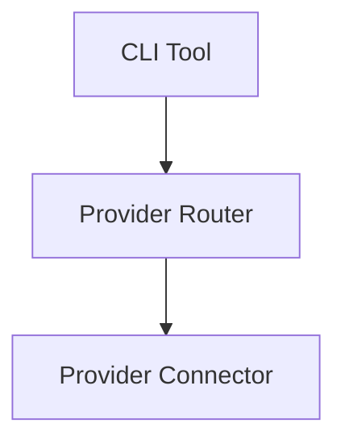

# Specification Workflow

## Core Principles

**Spec-First Paradigm**: Specifications define the contract BEFORE implementation exists.

**Language Agnostic**: Any language (TypeScript, Go, Python, Rust) must be able to implement this spec and produce the same behavior.

**Implementation Independent**: Never reference specific packages, classes, or implementation details.

## Step 1: Identify the Subject

What are you specifying?

**Valid subjects**:
- A component (Configuration Loader, Provider Router, MCP Server)
- A command (chat, conversation, benchmark)
- A protocol (MCP, configuration format)
- An interface (connector interface, API contract)

**Invalid subjects**:
- A feature (that's for feature docs)
- An implementation (that's for package docs)
- A use case (that's already defined)

## Step 2: Link to Use Cases


Ask: "Which use cases require this spec?"

Review existing use cases:
```bash
ls docs/products/[product-name]/specs/
```

If no use case exists, **stop**. Create the use case first using `/use-case`.

## Step 3: Define the Contract

{{ ... }}
Specs must define **WHAT**, not **HOW**:

### For Components:
- **Responsibility**: What does it do?
- **Requirements**: What must it support?
- **Interface**: How do other components interact with it?
- **Behavior**: What happens in specific scenarios?

### For Commands:
- **Syntax**: Exact command structure
- **Arguments**: All flags, options, formats
- **Output**: Exact format (with examples)
- **Exit codes**: All possible exit codes
- **Error handling**: Behavior on failures
- **Examples**: Concrete usage examples

### For Protocols:
- **Message format**: Exact structure
- **Request/response**: All message types
- **Error codes**: All possible errors
- **State machine**: Valid state transitions

## Step 4: Enforce Language Agnosticism

**Review checklist**:
- [ ] No package names (`@anygpt/router` ❌)
- [ ] No class names (`GenAIRouter` ❌)
- [ ] No function names (`setupRouter()` ❌)
- [ ] No language-specific terms (`import type` ❌)
- [ ] No implementation details (`uses Redis` ❌)

**Good examples**:
- ✅ "Configuration Loader" (not `@anygpt/config`)
- ✅ "Provider Router" (not `GenAIRouter class`)
- ✅ "Loads configuration from multiple sources" (not "uses cosmiconfig")

## Step 5: Provide Concrete Examples

**Every spec MUST include**:
- Command examples (for CLI specs)
- Input/output examples (for all specs)
- Error examples (what happens when things fail)
- Edge cases (boundary conditions)

**Format**:
```bash
# Good: Shows exact command
anygpt benchmark --models gpt-4o,claude --prompt "test"

# Bad: Describes command
"Run benchmark with models and prompt"
```

## Step 6: Check Internal Consistency

**Review the spec**:
- [ ] No contradictions (e.g., "required" then "optional")
- [ ] No ambiguity (e.g., "fast" - how fast?)
- [ ] No missing pieces (e.g., error handling not defined)
- [ ] All references valid (e.g., links to other specs work)

**Test**: Could two developers implement this and produce identical behavior?

## Step 7: Architecture Diagrams (Optional)

For component specs, include high-level architecture:

**Good diagram**:


**Bad diagram**:
```mermaid
graph TD
    CLI[@anygpt/cli] --> Router[@anygpt/router]
    Router --> OpenAI[@anygpt/openai]
```

## Step 8: Break Apart If Needed

**When to split**:
- Spec is >500 lines
- Multiple distinct subjects in one file
- Different audiences (e.g., CLI commands vs MCP protocol)

**How to split**:
- Create subdirectory (e.g., `spec/cli/`)
- One file per command/component
- Main README links to all parts

## Step 9: Cross-Reference

**Link to**:
- ✅ Use cases (why this exists)
- ✅ Other specs (related components)
- ❌ NOT implementation docs
- ❌ NOT feature guides

## Template: Component Spec

```markdown
# [Component Name] Specification

**Related Use Cases**: [Link to use cases]

## Responsibility

[What this component does]

## Requirements

- Requirement 1
- Requirement 2

## Interface

[How other components interact with this]

### Input
[What it receives]

### Output
[What it produces]

## Behavior

### Scenario 1
[What happens in this case]

### Error Handling
[What happens when things fail]

## Examples

[Concrete examples]
```

## Template: Command Spec

```markdown
# [Command Name] Specification

**Related Use Case**: [Link]

## Command Syntax

\`\`\`bash
command-name [arguments] [options]
\`\`\`

## Required Arguments

### `--arg-name <value>`
[Description]

**Format**: [Exact format]

**Examples**:
\`\`\`bash
--arg-name value1
--arg-name value2
\`\`\`

## Optional Arguments

[Same structure]

## Output Format

[Exact output with examples]

## Exit Codes

- `0`: Success
- `1`: Error type 1
- `2`: Error type 2

## Error Handling

[What happens on errors]

## Examples

[Concrete usage examples]
```

## Quality Checklist

Before finalizing:
- [ ] Subject is clearly defined
- [ ] Linked to at least one use case
- [ ] Language agnostic (no implementation details)
- [ ] Concrete examples provided
- [ ] Internally consistent (no contradictions)
- [ ] Complete (no missing pieces)
- [ ] Could be implemented in any language
- [ ] Two developers would produce identical behavior

## Red Flags

**Stop if you see**:
- "We use package X" (implementation detail)
- "The TypeScript class does..." (language-specific)
- "Users should..." (that's feature docs, not spec)
- Vague terms without examples ("fast", "efficient", "simple")
- Missing error handling
- No examples

## Notes

- Specs are contracts, not suggestions
- If you can't define the exact behavior, it's not ready to spec
- When in doubt, add more examples
- Specs should be boring and precise, not creative
