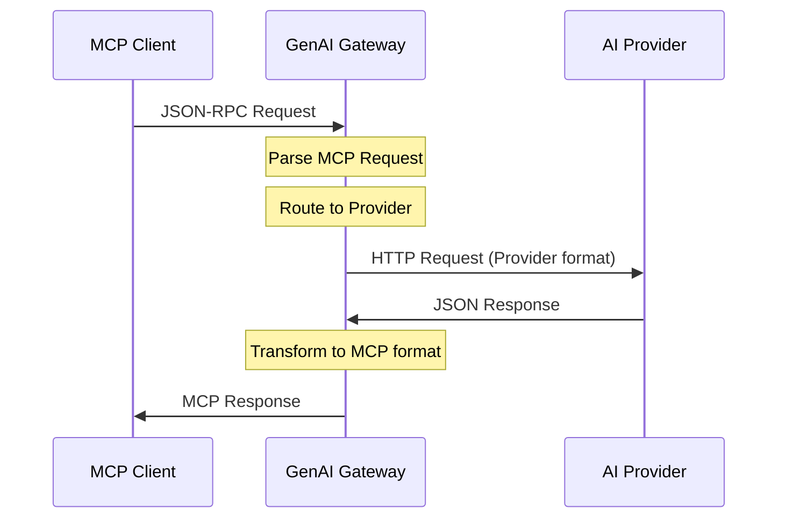

# AnyGPT Technical Specifications

Technical specifications defining **WHAT** we build and **HOW** it works.

## 📋 Specifications

### Core Components

- **[CLI Interface](./cli/README.md)** - Command-line interface design ([Use Case: Conversations](../use-cases/conversations.md))
- **[MCP Server](./mcp-server.md)** - MCP protocol implementation ([Use Case: Cross-Component Agents](../use-cases/mcp-server.md))
- **[Client Configuration](./client.md)** - MCP client setup ([Use Case: Flexible Configuration](../use-cases/flexible-configuration.md))

### ⚠️ Outdated Specs (Do Not Use)

- **[Components Design](./components.md)** - Describes non-existent `genai-gateway` package architecture
- **[Docker Integration](./docker.md)** - Outdated containerization approach

### CLI Commands

- **[Chat Command](./cli/chat.md)** - Stateless AI interaction
- **[Conversation Command](./cli/conversation.md)** - Stateful interaction ([Use Case: Context Optimization](../use-cases/context-optimization.md))
- **[Config Command](./cli/config.md)** - Configuration management

## 1. Introduction

### Goal

Create a comprehensive TypeScript ecosystem for building AI-powered applications with support for multiple providers, flexible configuration, CLI tools, and MCP protocol integration.

### Problems Solved

See [Use Cases](../use-cases/) for detailed problem statements and business value:

- **[Provider Lock-in](../use-cases/provider-agnostic-chat.md)**: Vendor-specific APIs require code rewrites
- **[Configuration Complexity](../use-cases/flexible-configuration.md)**: Hardcoded settings, no type safety
- **[MCP Limitations](../use-cases/mcp-server.md)**: MCP clients locked to single providers
- **[Cost Management](../use-cases/cost-optimization.md)**: No intelligent model routing
- **[Testing Challenges](../use-cases/rapid-prototyping.md)**: Expensive, slow, non-deterministic tests

### Solution Architecture

**Modular ecosystem** with:

- **Type-safe foundation**: Zero runtime overhead
- **Provider abstraction**: Unified interface for any AI provider
- **Dynamic configuration**: Runtime connector loading
- **CLI tools**: Chat and conversation management
- **MCP server**: Protocol bridge for MCP clients

## 2. Objectives

- **Modular Architecture**: Clean separation of concerns with single-responsibility packages
- **Zero Runtime Overhead**: Type-only packages with compile-time imports
- **Dynamic Configuration**: Runtime connector loading without hardcoded dependencies
- **Multi-Provider Support**: OpenAI, OpenAI-compatible APIs, local models
- **Developer Experience**: CLI tools, comprehensive documentation, testing utilities
- **MCP Compliance**: Full MCP protocol implementation for client integration

## 3. Architecture Diagram

```mermaid
graph TD
    CLI[CLI Tool] --> Config[@anygpt/config]
    MCP[MCP Client] --> MCPServer[genai-gateway-mcp]

    Config --> Router[@anygpt/router]
    MCPServer --> Router

    Router --> OpenAI[@anygpt/openai]
    Router --> Mock[@anygpt/mock]

    Config --> Types[@anygpt/types]
    Mock --> Types

    subgraph "Core Packages"
        Types
        Config
        Router
    end

    subgraph "Connector Packages"
        OpenAI
        Mock
    end

    subgraph "Application Packages"
        CLI
        MCPServer
    end

    subgraph "AI Providers"
        OpenAIAPI[OpenAI API]
        Ollama[Ollama]
        LocalAI[LocalAI]
    end

    OpenAI --> OpenAIAPI
    OpenAI --> Ollama
    OpenAI --> LocalAI
```

## 4. System Components

### 4.1 Core Packages

#### @anygpt/types

- **Purpose**: Pure TypeScript type definitions
- **Dependencies**: None (zero runtime overhead)
- **Key Types**: ConnectorFactory, ChatCompletionRequest, ModelInfo, AnyGPTConfig
- **Usage**: Always use `import type` syntax

#### @anygpt/router

- **Purpose**: Core routing and connector registry
- **Dependencies**: None (uses types internally)
- **Key Classes**: GenAIRouter, ConnectorRegistry, BaseConnector
- **Features**: Provider abstraction, connector pattern, type safety

#### @anygpt/config

- **Purpose**: Configuration management and dynamic connector loading
- **Dependencies**: @anygpt/types
- **Key Features**: Multiple config sources, runtime connector loading, setupRouter utility
- **Config Locations**: Project, user home, system-wide

### 4.2 Connector Packages

#### @anygpt/openai

- **Purpose**: OpenAI and OpenAI-compatible API connector
- **Dependencies**: @anygpt/router, openai SDK
- **Supported APIs**: OpenAI, Ollama, LocalAI, Together AI, Anyscale
- **Features**: Chat completions, model listing, response API fallback

#### @anygpt/mock

- **Purpose**: Mock connector for testing and development
- **Dependencies**: @anygpt/types
- **Features**: Configurable delays, failure simulation, custom responses
- **Use Cases**: Unit testing, development, offline work

### 4.3 Application Packages

#### @anygpt/cli

- **Purpose**: Command-line interface for AI interactions
- **Dependencies**: @anygpt/config, @anygpt/mock
- **Features**: Stateless chat, stateful conversations, forking, summarization
- **Commands**: chat, conversation (start/message/list/fork/summarize)

#### genai-gateway-mcp

- **Purpose**: MCP server implementation
- **Dependencies**: @anygpt/router (and connectors via dynamic loading)
- **Interface**: JSON-RPC MCP protocol over stdin/stdout
- **Tools**: chat_completion, list_models

### 4.4 Configuration System

**Configuration Files** (searched in order):

1. `./anygpt.config.ts` (project)
2. `./anygpt.config.js`
3. `./anygpt.config.json`
4. `~/.anygpt/anygpt.config.ts` (user)
5. `~/.anygpt/anygpt.config.js`
6. `~/.anygpt/anygpt.config.json`

**Dynamic Connector Loading**:

- Connectors specified in config are loaded at runtime
- No hardcoded dependencies in CLI or MCP server
- Users install only needed connector packages

## 5. Data Flow



### Flow Steps:

1. **MCP client** sends a JSON-RPC request → **GenAI Gateway**
2. **Gateway** routes request to appropriate AI provider
3. **Gateway** converts the request into provider-specific HTTP format
4. **Provider response** is normalized into MCP format
5. **Gateway** returns the result back to the client

## 6. Future Considerations

See [Project Documentation](../../project/) for roadmap and feature planning.

Potential enhancements being evaluated:

- Response caching for performance
- Streaming support for real-time responses
- Advanced monitoring and observability
- Request/response transformation pipelines
