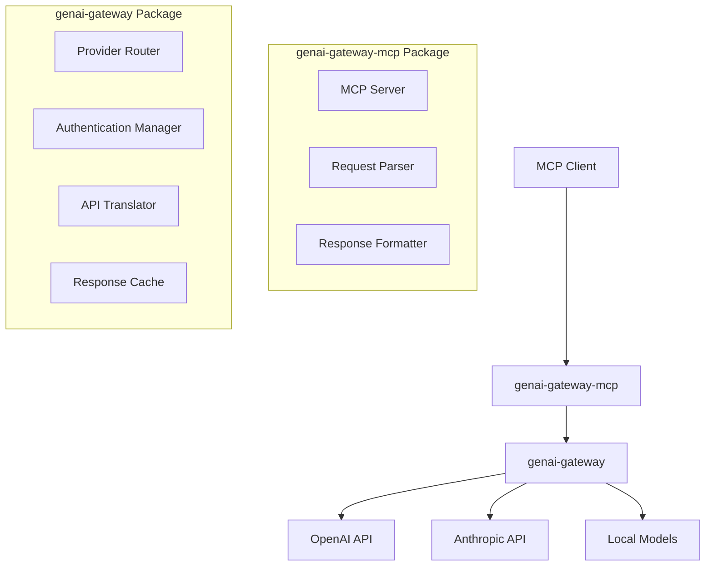

# Components Design Specification

## Overview

The GenAI Gateway MCP system consists of two main packages in an NX monorepo architecture, providing a layered approach to AI provider integration.

## Architecture



## Package Structure

### genai-gateway Package

**Purpose**: Secure gateway service managing AI provider connections and credentials.

**Core Components**:

#### 1. Provider Router
- **Responsibility**: Route requests to appropriate AI providers
- **Configuration**: Provider selection based on model name or explicit provider type
- **Supported Providers**: OpenAI, Anthropic, Local Models, Azure OpenAI

#### 2. Authentication Manager
- **Responsibility**: Manage API keys and authentication for different providers
- **Security**: Credential isolation, no logging of sensitive data
- **Configuration**: Environment-based credential management

#### 3. API Translator
- **Responsibility**: Convert between provider-specific API formats
- **Providers**:
  - **OpenAI**: Standard OpenAI format
  - **Anthropic**: Claude messages format
  - **Local**: Ollama/LM Studio format
  - **Azure**: Azure OpenAI format

#### 4. Response Cache (Optional)
- **Responsibility**: Cache responses for performance optimization
- **Configuration**: TTL-based caching with configurable policies
- **Storage**: In-memory or Redis-based

### genai-gateway-mcp Package

**Purpose**: MCP server implementation using the gateway for API access.

**Core Components**:

#### 1. MCP Server
- **Responsibility**: Implement MCP protocol over stdin/stdout
- **Protocol**: JSON-RPC 2.0 over stdio
- **Transport**: Standard MCP transport layer

#### 2. Request Parser
- **Responsibility**: Parse and validate MCP requests
- **Validation**: Schema validation for MCP protocol compliance
- **Error Handling**: Convert parsing errors to MCP error format

#### 3. Response Formatter
- **Responsibility**: Format gateway responses into MCP format
- **Conversion**: Provider responses → MCP-compliant responses
- **Error Mapping**: Provider errors → MCP error codes

## Provider Support Matrix

| Provider | Models | Chat | Embeddings | Tools | Status |
|----------|--------|------|------------|-------|--------|
| OpenAI | GPT-3.5, GPT-4, GPT-4o | ✅ | ✅ | ✅ | Implemented |
| Anthropic | Claude-3, Claude-3.5 | ✅ | ❌ | ✅ | Planned |
| Azure OpenAI | GPT models | ✅ | ✅ | ✅ | Planned |
| Ollama | Local models | ✅ | ❌ | ❌ | Planned |
| LM Studio | Local models | ✅ | ❌ | ❌ | Planned |

## Data Flow

### Request Flow
1. **MCP Client** sends JSON-RPC request to **genai-gateway-mcp**
2. **Request Parser** validates and parses MCP request
3. **genai-gateway-mcp** forwards request to **genai-gateway**
4. **Provider Router** determines target AI provider
5. **API Translator** converts to provider-specific format
6. **Authentication Manager** adds provider credentials
7. Request sent to **AI Provider**

### Response Flow
1. **AI Provider** returns response to **genai-gateway**
2. **Response Cache** optionally stores response
3. **API Translator** converts to standard format
4. **genai-gateway** returns response to **genai-gateway-mcp**
5. **Response Formatter** converts to MCP format
6. **MCP Server** sends JSON-RPC response to **MCP Client**

## Error Handling

### Error Categories
- **MCP Protocol Errors**: Invalid JSON-RPC, missing parameters
- **Gateway Errors**: Authentication failures, provider unavailable  
- **Provider Errors**: Rate limits, model not found, API errors

### Error Code Mapping
- Provider 401 → MCP -32001 (UNAUTHORIZED)
- Provider 429 → MCP -32002 (RATE_LIMITED)
- Provider 404 → MCP -32003 (MODEL_NOT_FOUND)

## Configuration Interface

### genai-gateway Configuration
```typescript
interface GatewayConfig {
  providers: {
    openai?: {
      apiKey: string;
      baseUrl?: string;
      organization?: string;
    };
    anthropic?: {
      apiKey: string;
      baseUrl?: string;
    };
    local?: {
      baseUrl: string;
      type: 'ollama' | 'lmstudio';
    };
  };
  cache?: {
    enabled: boolean;
    ttl: number;
    storage: 'memory' | 'redis';
  };
  routing: {
    defaultProvider: string;
    modelMapping: Record<string, string>;
  };
}
```

### genai-gateway-mcp Configuration
```typescript
interface MCPConfig {
  gateway: {
    url: string;
    apiKey: string;
  };
  mcp: {
    name: string;
    version: string;
  };
  logging: {
    level: 'debug' | 'info' | 'warn' | 'error';
  };
}
```

## Security Considerations

### Credential Management
- **Isolation**: Each provider's credentials stored separately
- **Encryption**: Credentials encrypted at rest
- **Rotation**: Support for credential rotation without restart

### Network Security
- **TLS**: All external communications use HTTPS/WSS
- **Validation**: Input validation and sanitization
- **Rate Limiting**: Built-in rate limiting per provider

### Audit Trail
- **Request Logging**: Log requests without sensitive data
- **Error Tracking**: Comprehensive error logging
- **Metrics**: Performance and usage metrics collection
