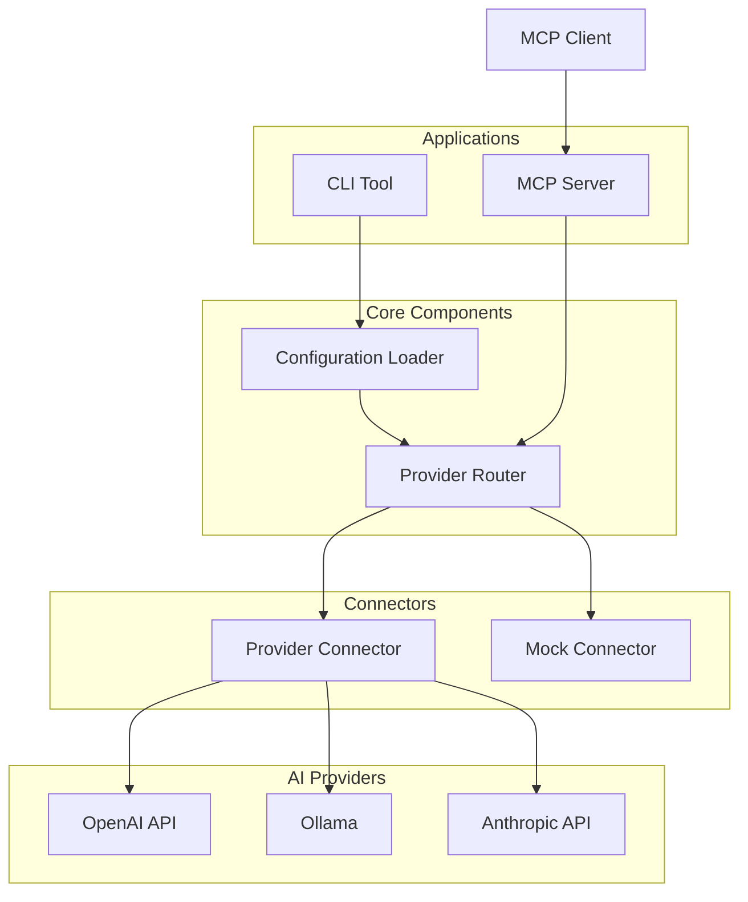
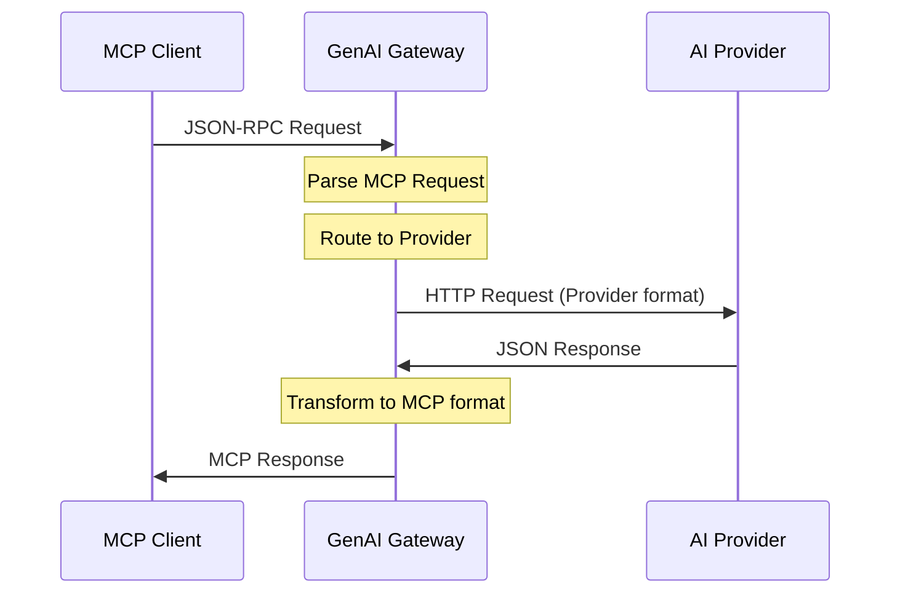

# AnyGPT Technical Specifications

Technical specifications defining **WHAT** we build and **HOW** it works.

## 📋 Specifications

### Core Components

- **[CLI Interface](./cli/README.md)** - Command-line interface design ([Use Case: Conversations](../cases/conversations.md))
- **[MCP Server](./anygpt/docker-mcp/mcp-server.md)** - MCP protocol implementation ([Use Case: Cross-Component Agents](../cases/mcp-server.md))
- **[MCP Discovery](./anygpt/mcp-discovery.md)** - On-demand tool discovery for multi-MCP environments ([Use Case: MCP Tool Discovery](../cases/mcp-tool-discovery.md))
- **[Docker MCP Toolkit Integration](./anygpt/docker-mcp/docker-mcp-toolkit.md)** - Centralized MCP server deployment ([Use Case: Docker MCP Toolkit](../cases/docker-mcp-toolkit.md))

### CLI Commands

- **[Chat Command](./cli/chat.md)** - Stateless AI interaction
- **[Conversation Command](./cli/conversation.md)** - Stateful interaction ([Use Case: Context Optimization](../use-cases/context-optimization.md))
- **[Config Command](./cli/config.md)** - Configuration management

## 1. Introduction

### Goal

Create a comprehensive TypeScript ecosystem for building AI-powered applications with support for multiple providers, flexible configuration, CLI tools, and MCP protocol integration.

### Problems Solved

See [Use Cases](../use-cases/) for detailed problem statements and business value:

- **[Provider Lock-in](../use-cases/provider-agnostic-chat.md)**: Vendor-specific APIs require code rewrites
- **[Configuration Complexity](../use-cases/flexible-configuration.md)**: Hardcoded settings, no type safety
- **[MCP Limitations](../use-cases/mcp-server.md)**: MCP clients locked to single providers
- **[Cost Management](../use-cases/cost-optimization.md)**: No intelligent model routing
- **[Testing Challenges](../use-cases/rapid-prototyping.md)**: Expensive, slow, non-deterministic tests

### Solution Architecture

**Modular ecosystem** with:

- **Type-safe foundation**: Zero runtime overhead
- **Provider abstraction**: Unified interface for any AI provider
- **Dynamic configuration**: Runtime connector loading
- **CLI tools**: Chat and conversation management
- **MCP server**: Protocol bridge for MCP clients

## 2. Objectives

- **Modular Architecture**: Clean separation of concerns with single-responsibility packages
- **Dynamic Configuration**: Runtime connector loading without hardcoded dependencies
- **Multi-Provider Support**: OpenAI, OpenAI-compatible APIs, local models
- **Developer Experience**: CLI tools, comprehensive documentation, testing utilities
- **MCP Compliance**: Full MCP protocol implementation for client integration

## 3. Architecture

## 4. Core Components

### Configuration Loader

**Responsibility**: Load and validate configuration from multiple sources

**Requirements**:

- Search hierarchy: project → user home → system-wide
- Runtime connector loading based on configuration
- Type validation and error reporting

### Provider Router

**Responsibility**: Route requests to appropriate AI provider connectors

**Requirements**:

- Provider abstraction layer
- Connector registry pattern
- Request/response normalization
- Error handling and retry logic

**Routing Strategies** ([Use Case: Cost Optimization](../use-cases/cost-optimization.md)):

- Route by explicit provider selection
- Route by model name pattern matching
- Route by cost/quality tradeoffs
- Route by custom rules (complexity, user tier, etc.)

**Failover Strategy** ([Use Case: Resilience & Failover](../use-cases/resilience-failover.md)):

- Automatic retry on transient failures
- Fallback to backup provider on primary failure
- Circuit breaker pattern for failing providers
- Configurable retry policies (max attempts, backoff)

### Provider Connectors

**Responsibility**: Implement provider-specific API integration

**Requirements**:
{{ ... }}

- Unified interface for all providers
- Chat completion support
- Model listing support
- Streaming support (optional)
- Provider-specific error mapping

### CLI Tool

**Responsibility**: Command-line interface for AI interactions

**Requirements**:

- Stateless chat command
- Stateful conversation management
- Context optimization (fork, summarize)
- Configuration inspection

### MCP Server

**Responsibility**: MCP protocol implementation

**Requirements**:

- JSON-RPC 2.0 over stdin/stdout
- MCP protocol compliance
- Tool registration (chat_completion, list_models)
- Provider routing integration

## 5. Configuration Format

**Configuration Search Order**:

1. `./anygpt.config.ts` (project)
2. `./anygpt.config.js`
3. `./anygpt.config.json`
4. `~/.anygpt/anygpt.config.ts` (user)
5. `~/.anygpt/anygpt.config.js`
6. `~/.anygpt/anygpt.config.json`

**Dynamic Connector Loading**:

- Connectors specified in config are loaded at runtime
- No hardcoded dependencies
- Modular connector system

## 6. Data Flow

### Flow Steps:

1. **MCP client** sends a JSON-RPC request → **MCP Server**
2. **MCP Server** routes request to appropriate AI provider via **Router**
3. **Connector** converts the request into provider-specific format
4. **Provider response** is normalized by **Connector**
5. **MCP Server** returns the result back to the client

## 7. Future Considerations

See [Project Documentation](../../project/) for roadmap and feature planning.

Potential enhancements being evaluated:

- Response caching for performance
- Streaming support for real-time responses
- Advanced monitoring and observability
- Request/response transformation pipelines
