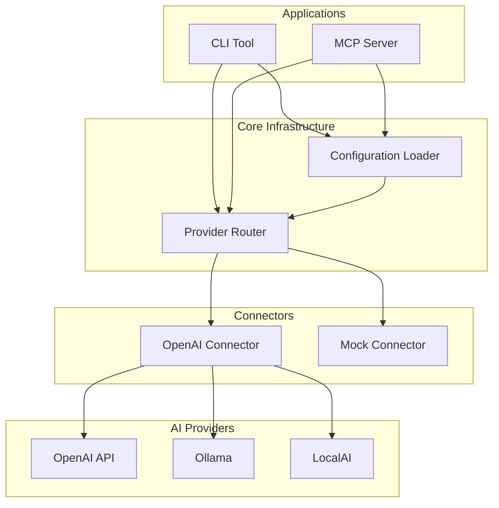

# AnyGPT TypeScript - Architecture

**Project**: AnyGPT TypeScript Monorepo  
**Last Updated**: 2025-01-10  
**Status**: Design Phase

## Overview

AnyGPT is a TypeScript ecosystem for building AI-powered applications with support for multiple providers, flexible configuration, CLI tools, and MCP protocol integration.

## High-Level Architecture



## Component Overview

### Applications Layer

**CLI Tool**
- **Purpose**: Command-line interface for AI interactions
- **Features**: chat, conversation, config, benchmark commands
- **Dependencies**: Configuration Loader, Provider Router

**MCP Server**
- **Purpose**: MCP protocol server for IDE/tool integration
- **Features**: JSON-RPC over stdin/stdout, provider routing
- **Dependencies**: Configuration Loader, Provider Router

### Core Infrastructure

**Types Package**
- **Purpose**: Pure TypeScript type definitions (zero runtime)
- **Responsibilities**:
  - Define all interfaces and types
  - Shared across all packages
  - Compile-time only (no runtime code)
  - Prevent circular dependencies
- **Dependencies**: None (foundation)

**Configuration Loader**
- **Purpose**: Load and validate configuration from multiple sources
- **Responsibilities**:
  - Search hierarchy (project → user → system)
  - Support multiple formats (TypeScript, JSON, YAML)
  - Runtime connector loading
  - Type validation
- **Dependencies**: Types Package

**Provider Router**
- **Purpose**: Abstract provider differences, route requests
- **Responsibilities**:
  - Provider abstraction layer
  - Connector registry
  - Request/response normalization
  - Error handling and retry logic
  - Routing strategies (cost, failover)
- **Dependencies**: Configuration Loader

### Connectors Layer

**OpenAI Connector**
- **Purpose**: OpenAI and OpenAI-compatible API integration
- **Supports**: OpenAI, Ollama, LocalAI, Together AI, Anyscale
- **Dependencies**: Provider Router

**Mock Connector**
- **Purpose**: Testing and development without real API calls
- **Features**: Configurable delays, failure simulation
- **Dependencies**: Provider Router

## Module Structure

```
packages/
├── types/              (Pure type definitions)
├── config/             (Configuration Loader)
├── router/             (Provider Router)
├── connectors/
│   ├── openai/        (OpenAI Connector)
│   └── mock/          (Mock Connector)
├── cli/               (CLI Tool)
└── mcp/               (MCP Server)
```

## Data Flow

### CLI Request Flow
```
User Command
    ↓
CLI Parser
    ↓
Configuration Loader → Load config
    ↓
Provider Router → Select provider
    ↓
Connector → Call API
    ↓
Provider API → Response
    ↓
Router → Normalize response
    ↓
CLI → Format output
    ↓
User
```

### MCP Request Flow
```
MCP Client (IDE)
    ↓
JSON-RPC over stdin
    ↓
MCP Server → Parse request
    ↓
Configuration Loader → Load config
    ↓
Provider Router → Select provider
    ↓
Connector → Call API
    ↓
Provider API → Response
    ↓
Router → Normalize response
    ↓
MCP Server → Format JSON-RPC response
    ↓
JSON-RPC over stdout
    ↓
MCP Client (IDE)
```

## Key Design Decisions

### 1. Monorepo Structure
- **Decision**: Use Nx monorepo
- **Rationale**: 
  - Shared code between packages
  - Consistent tooling
  - Atomic changes across packages
  - Better dependency management

### 2. Type-Only Packages
- **Decision**: Separate type definitions from runtime code
- **Rationale**:
  - Zero runtime overhead
  - Compile-time imports only
  - Prevents circular dependencies

### 3. Dynamic Connector Loading
- **Decision**: Load connectors at runtime based on config
- **Rationale**:
  - No hardcoded dependencies
  - Users install only needed connectors
  - Extensible architecture

### 4. Provider Abstraction
- **Decision**: Unified interface for all providers
- **Rationale**:
  - Swap providers without code changes
  - Consistent error handling
  - Easy to add new providers

### 5. Configuration Hierarchy
- **Decision**: Project → User → System config search
- **Rationale**:
  - Project-specific overrides
  - User preferences
  - System defaults
  - Predictable precedence

## Technology Stack

### Core
- **Language**: TypeScript
- **Runtime**: Node.js 18+
- **Build**: Nx, tsdown
- **Package Manager**: npm/pnpm

### CLI
- **Argument Parsing**: commander
- **Validation**: zod
- **Storage**: Local filesystem (JSON)

### Testing
- **Framework**: Vitest
- **E2E**: Custom test harness
- **Mocking**: Built-in mock connector

### MCP
- **Protocol**: JSON-RPC 2.0
- **Transport**: stdin/stdout
- **Spec**: MCP Protocol v1.0

## Deployment Targets

### CLI Tool
- **Distribution**: npm package
- **Installation**: `npm install -g @anygpt/cli`
- **Usage**: `anygpt <command>`

### MCP Server
- **Distribution**: npm package + Docker image
- **NPM**: `npx @anygpt/mcp`
- **Docker**: `docker run ghcr.io/org/anygpt-mcp`
- **Docker MCP Toolkit**: Centralized deployment

## Security Considerations

### Credentials
- API keys via environment variables
- Never log credentials
- Secure storage in config files

### Input Validation
- Validate all user input
- Sanitize command arguments
- Type-safe configuration

### Network
- HTTPS only for API calls
- Timeout and retry limits
- Rate limiting support

## Scalability

### Stateless Design
- CLI: No persistent state (except conversations)
- MCP Server: Stateless, horizontally scalable
- Configuration: Cached, reloadable

### Performance
- Minimal startup time
- Lazy loading of connectors
- Efficient configuration parsing

## Extension Points

### New Providers
1. Implement connector interface
2. Publish as separate package
3. Users add to configuration

### New Commands
1. Add command to CLI package
2. Follow existing patterns
3. Use shared infrastructure

### New MCP Methods
1. Add handler to MCP server
2. Route through provider router
3. Follow MCP protocol spec

## Future Extensions

### Potential Enhancements
- **Streaming Support**: Real-time response streaming for long outputs
- **Response Caching**: Cache responses with TTL for performance
- **Additional Connectors**: Anthropic, Google AI, Azure OpenAI, etc.
- **Conversation Storage**: Pluggable storage backends (SQLite, PostgreSQL)
- **Metrics & Observability**: Prometheus metrics, OpenTelemetry tracing
- **Web UI**: Browser-based interface for conversations
- **Plugin System**: User-defined tools and extensions
- **Multi-user Support**: Team collaboration features
- **Advanced Routing**: Load balancing, A/B testing, canary deployments

### Extension Architecture

The system is designed to be extended without modifying core:

**New Providers**:
```
packages/connectors/anthropic/  ← New package
└── Implements connector interface
```

**New Commands**:
```
packages/cli/src/commands/new-command.ts  ← New file
└── Uses existing infrastructure
```

**New Storage Backends**:
```
packages/storage/postgresql/  ← New package
└── Implements storage interface
```

**Plugin System** (Future):
```
packages/plugins/
├── api/           ← Plugin API
└── loader/        ← Dynamic plugin loading
```

## Open Questions

- [ ] Conversation storage format (JSON, SQLite, other)?
- [ ] Streaming support priority and implementation approach?
- [ ] Caching strategy (in-memory, Redis, file-based)?
- [ ] Metrics and observability approach (Prometheus, OpenTelemetry)?
- [ ] Plugin system design and security model?

## References

- **Specs**: [docs/products/anygpt/specs/](../../product/spec/)
- **Use Cases**: [docs/products/anygpt/use-cases/](../../product/use-cases/)
- **Nx Documentation**: https://nx.dev
- **MCP Protocol**: https://modelcontextprotocol.io
