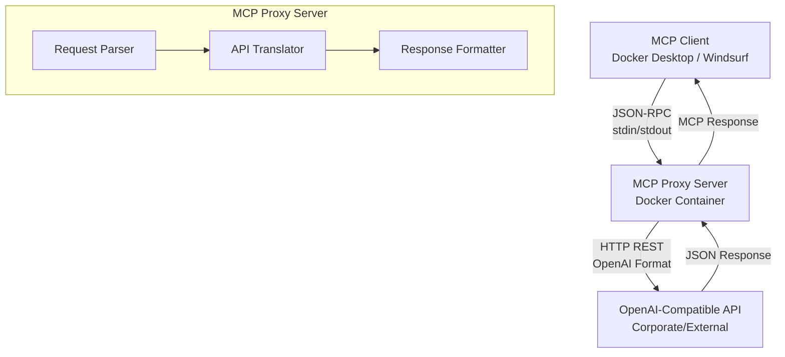
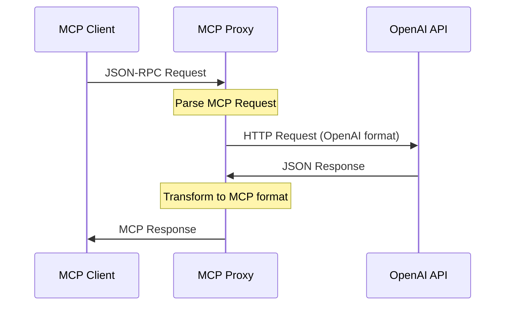

# OpenAI-Compatible MCP Proxy Server

## 1. Introduction

### Goal
Create an MCP server proxy that connects to our corporate OpenAI-compatible API and exposes it to any client supporting the MCP protocol (e.g., Docker Desktop MCP Toolkit, Windsurf, etc.).

### Problem
- **MCP clients** can only interact with MCP servers
- **Our API** is OpenAI-compatible but cannot be directly integrated with MCP
- **We need** a bridging layer

### Solution
Develop an **MCP Proxy Server** that:
- Runs as a containerized MCP server (Docker)
- Accepts MCP requests (via JSON-RPC over stdin/stdout)
- Translates them into OpenAI-compatible API calls
- Returns responses in MCP-compliant format

## 2. Objectives

- **Universal Bridge**: Provide a bridge between MCP and OpenAI-compatible APIs
- **Core Features**: Support core MCP features (chat, completion, tools)
- **Authentication**: Handle authentication via API keys/environment variables
- **Extensibility**: Ensure extensibility for new endpoints
- **Multi-Provider**: Allow routing to multiple models/providers if needed

## 3. Architecture Diagram

## 4. System Components

### 4.1 MCP Proxy Server
- **Runtime**: Docker MCP server container
- **Interface**: JSON-RPC MCP protocol over stdin/stdout
- **Supported Commands**:
  - `listModels` → proxied to `/models`
  - `createCompletion` → proxied to `/chat/completions`
  - `callTool` → maps to custom API tools (optional)

### 4.2 OpenAI-Compatible API
REST API implementing OpenAI SDK-compatible endpoints:
- `/models` - List available models
- `/chat/completions` - Chat completions endpoint
- `/embeddings` - Text embeddings (optional)
- `/completions` - Legacy completions (optional)

### 4.3 Configuration
**Environment Variables**:
- `API_BASE_URL` — Base URL of the OpenAI-compatible API
- `API_KEY` — Authentication token
- `DEFAULT_MODEL` — Default model name
- `TIMEOUT` — Request timeout in seconds (default: 30)
- `MAX_RETRIES` — Maximum retry attempts (default: 3)

**Distribution**: Docker image with configurable environment

## 5. Data Flow

### Flow Steps:
1. **MCP client** sends a JSON-RPC request → **MCP Proxy**
2. **Proxy** converts the request into an HTTP request for the OpenAI-compatible API
3. **API response** is normalized into MCP format
4. **Proxy** returns the result back to the client

## 6. Non-Functional Requirements

### Performance
- **Minimal latency** through direct proxying without unnecessary processing
- **Efficient memory usage** for handling concurrent requests
- **Fast startup time** for container deployment

### Reliability
- **Consistent error handling** and conversion into MCP-compatible errors
- **Graceful degradation** when upstream API is unavailable
- **Request/response validation** to ensure data integrity

### Security
- **API key protection**: Never logged, passed only via secure headers
- **Input sanitization** to prevent injection attacks
- **Rate limiting** to prevent abuse
- **Secure defaults** for all configuration options

### Scalability
- **Horizontal scaling**: Multiple MCP Proxy instances behind load balancer
- **Resource efficiency**: Minimal CPU and memory footprint
- **Connection pooling** for upstream API calls

## 7. Possible Extensions

### Multi-Backend Support
- **Multi-provider routing** (OpenAI, Anthropic, local models)
- **Load balancing** across multiple API endpoints
- **Failover mechanisms** for high availability

### Performance Enhancements
- **Response caching** with configurable TTL
- **Request batching** for efficiency
- **Connection pooling** and keep-alive

### Monitoring & Observability
- **Metrics collection** (Prometheus/Grafana)
- **Request tracing** and logging
- **Health checks** and status endpoints

### Advanced Features
- **Virtual tools** in MCP that map to custom APIs
- **Request/response transformation** pipelines
- **Authentication middleware** for various auth methods

## 8. Risks & Mitigation

### Technical Risks
- **Response format mismatches**: MCP may require specific transformations
  - *Mitigation*: Comprehensive testing and format validation
- **Streaming support**: OpenAI `stream: true` → MCP events mapping
  - *Mitigation*: Implement proper stream-to-event conversion
- **MCP specification changes**: Protocol evolution over time
  - *Mitigation*: Version compatibility matrix and upgrade paths

### Operational Risks
- **API rate limiting**: Upstream provider limits
  - *Mitigation*: Implement backoff strategies and rate limiting
- **Authentication failures**: API key rotation/expiration
  - *Mitigation*: Graceful error handling and key refresh mechanisms

## 9. Implementation Roadmap

### Phase 1: Core Functionality
- [ ] **Minimal Node.js prototype** for MCP Proxy
- [ ] **Basic MCP protocol** implementation (JSON-RPC over stdio)
- [ ] **OpenAI API integration** for `/chat/completions`
- [ ] **Docker containerization** with basic configuration

### Phase 2: Production Ready
- [ ] **Error handling** and logging
- [ ] **Configuration management** via environment variables
- [ ] **Health checks** and monitoring endpoints
- [ ] **Integration testing** with Docker Desktop MCP Toolkit

### Phase 3: Advanced Features
- [ ] **Streaming support** for real-time responses
- [ ] **Multi-model support** and routing
- [ ] **Caching layer** for performance optimization
- [ ] **Windsurf integration** validation

### Phase 4: Enterprise Features
- [ ] **Multi-backend routing** (OpenAI, Anthropic, etc.)
- [ ] **Monitoring dashboard** (Prometheus/Grafana)
- [ ] **Advanced authentication** methods
- [ ] **Load balancing** and high availability