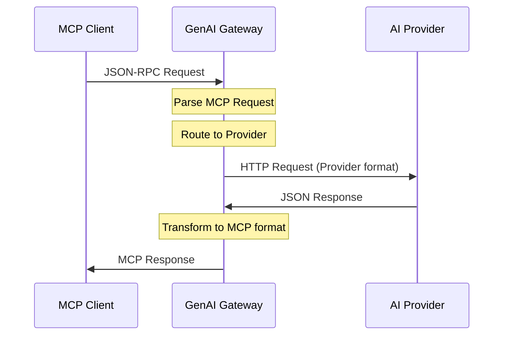

{{ ... }}

## Documentation Structure

This specification documents the AnyGPT ecosystem architecture:

- **[CLI Interface](./cli/README.md)** - Command-line interface design and concepts
- **[Components Design](./components.md)** - System architecture and component specifications *(Legacy - needs update)*
- **[Client Configuration](./client.md)** - MCP client setup and configuration
- **[MCP Server](./mcp-server.md)** - MCP server implementation details
- **[Docker Integration](./docker.md)** - Containerization and deployment *(Legacy - needs update)*

### CLI Command Specifications

- **[Chat Command](./cli/chat.md)** - Stateless AI interaction model
- **[Conversation Command](./cli/conversation.md)** - Stateful interaction with advanced features  
- **[Config Command](./cli/config.md)** - Configuration management system

## 1. Introduction

### Goal
Create a comprehensive TypeScript ecosystem for building AI-powered applications with support for multiple providers, flexible configuration, CLI tools, and MCP protocol integration.

### Problem
- **Complex AI Integration**: Different provider APIs, authentication methods, and response formats
- **Configuration Management**: Need for flexible, dynamic connector loading without hardcoded dependencies
- **Protocol Translation**: MCP clients need bridge to AI provider APIs
- **Developer Experience**: Need unified interface for AI interactions across different use cases

### Solution
Develop a **modular AnyGPT ecosystem** that provides:
- **Type-safe foundation**: Pure type definitions with zero runtime overhead
- **Flexible router system**: Provider abstraction with connector pattern
- **Dynamic configuration**: Runtime connector loading based on configuration
- **CLI interface**: Command-line tool for AI interactions and conversation management
- **MCP server**: Protocol translator for MCP clients

## 2. Objectives

- **Modular Architecture**: Clean separation of concerns with single-responsibility packages
- **Zero Runtime Overhead**: Type-only packages with compile-time imports
- **Dynamic Configuration**: Runtime connector loading without hardcoded dependencies
- **Multi-Provider Support**: OpenAI, OpenAI-compatible APIs, local models
- **Developer Experience**: CLI tools, comprehensive documentation, testing utilities
- **MCP Compliance**: Full MCP protocol implementation for client integration

## 3. Architecture Diagram

```mermaid
graph TD
    CLI[CLI Tool] --> Config[@anygpt/config]
    MCP[MCP Client] --> MCPServer[genai-gateway-mcp]
    
    Config --> Router[@anygpt/router]
    MCPServer --> Router
    
    Router --> OpenAI[@anygpt/openai]
    Router --> Mock[@anygpt/mock]
    
    Config --> Types[@anygpt/types]
    Mock --> Types
    
    subgraph "Core Packages"
        Types
        Config
        Router
    end
    
    subgraph "Connector Packages"
        OpenAI
        Mock
    end
    
    subgraph "Application Packages"
        CLI
        MCPServer
    end
    
    subgraph "AI Providers"
        OpenAIAPI[OpenAI API]
        Ollama[Ollama]
        LocalAI[LocalAI]
    end
    
    OpenAI --> OpenAIAPI
    OpenAI --> Ollama
    OpenAI --> LocalAI
```

## 4. System Components

### 4.1 Core Packages

#### @anygpt/types
- **Purpose**: Pure TypeScript type definitions
- **Dependencies**: None (zero runtime overhead)
- **Key Types**: ConnectorFactory, ChatCompletionRequest, ModelInfo, AnyGPTConfig
- **Usage**: Always use `import type` syntax

#### @anygpt/router
- **Purpose**: Core routing and connector registry
- **Dependencies**: None (uses types internally)
- **Key Classes**: GenAIRouter, ConnectorRegistry, BaseConnector
- **Features**: Provider abstraction, connector pattern, type safety

#### @anygpt/config
- **Purpose**: Configuration management and dynamic connector loading
- **Dependencies**: @anygpt/types
- **Key Features**: Multiple config sources, runtime connector loading, setupRouter utility
- **Config Locations**: Project, user home, system-wide

### 4.2 Connector Packages

#### @anygpt/openai
- **Purpose**: OpenAI and OpenAI-compatible API connector
- **Dependencies**: @anygpt/router, openai SDK
- **Supported APIs**: OpenAI, Ollama, LocalAI, Together AI, Anyscale
- **Features**: Chat completions, model listing, response API fallback

#### @anygpt/mock
- **Purpose**: Mock connector for testing and development
- **Dependencies**: @anygpt/types
- **Features**: Configurable delays, failure simulation, custom responses
- **Use Cases**: Unit testing, development, offline work

### 4.3 Application Packages

#### @anygpt/cli
- **Purpose**: Command-line interface for AI interactions
- **Dependencies**: @anygpt/config, @anygpt/mock
- **Features**: Stateless chat, stateful conversations, forking, summarization
- **Commands**: chat, conversation (start/message/list/fork/summarize)

#### genai-gateway-mcp
- **Purpose**: MCP server implementation
- **Dependencies**: @anygpt/router (and connectors via dynamic loading)
- **Interface**: JSON-RPC MCP protocol over stdin/stdout
- **Tools**: chat_completion, list_models

### 4.4 Configuration System

**Configuration Files** (searched in order):
1. `./anygpt.config.ts` (project)
2. `./anygpt.config.js`
3. `./anygpt.config.json`
4. `~/.anygpt/anygpt.config.ts` (user)
5. `~/.anygpt/anygpt.config.js`
6. `~/.anygpt/anygpt.config.json`

**Dynamic Connector Loading**:
- Connectors specified in config are loaded at runtime
- No hardcoded dependencies in CLI or MCP server
- Users install only needed connector packages

## 5. Data Flow



### Flow Steps:
1. **MCP client** sends a JSON-RPC request → **GenAI Gateway**
2. **Gateway** routes request to appropriate AI provider
3. **Gateway** converts the request into provider-specific HTTP format
4. **Provider response** is normalized into MCP format
5. **Gateway** returns the result back to the client

## 6. Non-Functional Requirements

### Performance
- **Minimal latency** through direct proxying without unnecessary processing
- **Efficient memory usage** for handling concurrent requests
- **Fast startup time** for container deployment

### Reliability
- **Consistent error handling** and conversion into MCP-compatible errors
- **Graceful degradation** when upstream API is unavailable
- **Request/response validation** to ensure data integrity

### Security
- **API key protection**: Never logged, passed only via secure headers
- **Input sanitization** to prevent injection attacks
- **Rate limiting** to prevent abuse
- **Secure defaults** for all configuration options

### Scalability
- **Horizontal scaling**: Multiple MCP Proxy instances behind load balancer
- **Resource efficiency**: Minimal CPU and memory footprint
- **Connection pooling** for upstream API calls

## 7. Possible Extensions

### Multi-Backend Support
- **Multi-provider routing** (OpenAI, Anthropic, local models)
- **Load balancing** across multiple API endpoints
- **Failover mechanisms** for high availability

### Performance Enhancements
- **Response caching** with configurable TTL
- **Request batching** for efficiency
- **Connection pooling** and keep-alive

### Monitoring & Observability
- **Metrics collection** (Prometheus/Grafana)
- **Request tracing** and logging
- **Health checks** and status endpoints

### Advanced Features
- **Virtual tools** in MCP that map to custom APIs
- **Request/response transformation** pipelines
- **Authentication middleware** for various auth methods

## 8. Risks & Mitigation

### Technical Risks
- **Response format mismatches**: MCP may require specific transformations
  - *Mitigation*: Comprehensive testing and format validation
- **Streaming support**: OpenAI `stream: true` → MCP events mapping
  - *Mitigation*: Implement proper stream-to-event conversion
- **MCP specification changes**: Protocol evolution over time
  - *Mitigation*: Version compatibility matrix and upgrade paths

### Operational Risks
- **API rate limiting**: Upstream provider limits
  - *Mitigation*: Implement backoff strategies and rate limiting
- **Authentication failures**: API key rotation/expiration
  - *Mitigation*: Graceful error handling and key refresh mechanisms

## 9. Implementation Roadmap

### Phase 1: Core Functionality
- [ ] **Minimal Node.js prototype** for MCP Proxy
- [ ] **Basic MCP protocol** implementation (JSON-RPC over stdio)
- [ ] **OpenAI API integration** for `/chat/completions`
- [ ] **Docker containerization** with basic configuration

### Phase 2: Production Ready
- [ ] **Error handling** and logging
- [ ] **Configuration management** via environment variables
- [ ] **Health checks** and monitoring endpoints
- [ ] **Integration testing** with Docker Desktop MCP Toolkit

### Phase 3: Advanced Features
- [ ] **Streaming support** for real-time responses
- [ ] **Multi-model support** and routing
- [ ] **Caching layer** for performance optimization
- [ ] **Windsurf integration** validation

### Phase 4: Enterprise Features
- [ ] **Multi-backend routing** (OpenAI, Anthropic, etc.)
- [ ] **Monitoring dashboard** (Prometheus/Grafana)
- [ ] **Advanced authentication** methods
- [ ] **Load balancing** and high availability