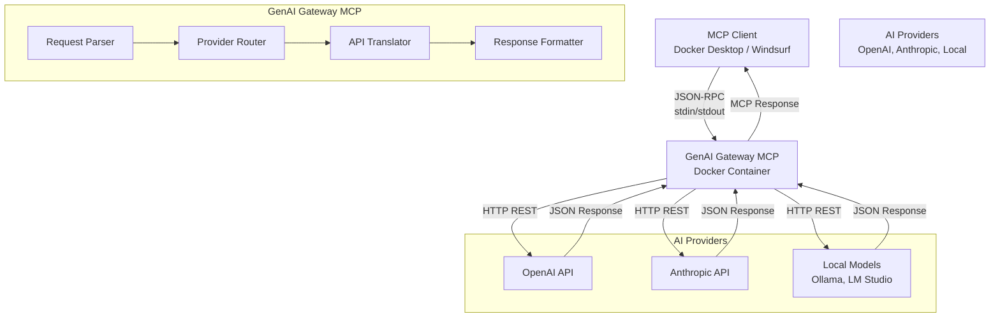
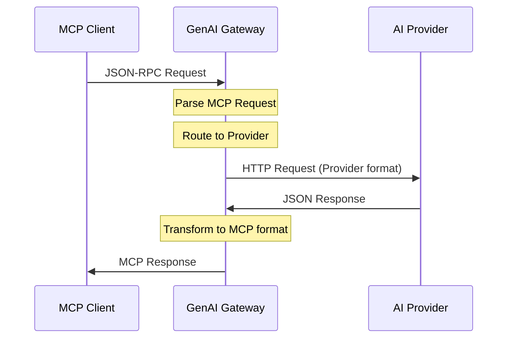

# GenAI Gateway MCP Server

## Documentation Structure

This specification is organized into focused documents:

- **[Components Design](./components.md)** - System architecture and component specifications
- **[Client Configuration](./client.md)** - Client setup, configuration, and usage
- **[MCP Server](./mcp-server.md)** - MCP server implementation and configuration  
- **[Docker Integration](./docker.md)** - Containerization and Docker deployment

## 1. Introduction

### Goal
Create an MCP server gateway that connects to multiple AI providers (OpenAI, Anthropic, local models, etc.) and exposes them to any client supporting the MCP protocol (e.g., Docker Desktop MCP Toolkit, Windsurf, etc.).

### Problem
- **MCP clients** can only interact with MCP servers
- **AI provider APIs** have different protocols and cannot be directly integrated with MCP
- **We need** a universal bridging layer for multiple providers

### Solution
Develop a **GenAI Gateway MCP Server** that:
- Runs as a containerized MCP server (Docker)
- Accepts MCP requests (via JSON-RPC over stdin/stdout)
- Translates them into provider-specific API calls (OpenAI, Anthropic, etc.)
- Returns responses in MCP-compliant format

## 2. Objectives

- **Universal Bridge**: Provide a bridge between MCP and multiple AI provider APIs
- **Multi-Provider Support**: OpenAI, Anthropic, local models, Azure OpenAI
- **Core Features**: Support core MCP features (chat, completion, tools)
- **Authentication**: Handle authentication via API keys/environment variables
- **Extensibility**: Plugin architecture for adding new providers

## 3. Architecture Diagram

## 4. System Components

### 4.1 GenAI Gateway MCP Server
- **Runtime**: Docker MCP server container
- **Interface**: JSON-RPC MCP protocol over stdin/stdout
- **Provider Support**: OpenAI, Anthropic, local models
- **Supported Commands**:
  - `listModels` → routes to provider `/models`
  - `createCompletion` → routes to provider completion endpoints
  - `callTool` → maps to provider-specific tools (optional)

### 4.2 AI Provider APIs
Supported provider endpoints:

**OpenAI/Azure OpenAI**:
- `/models` - List available models
- `/chat/completions` - Chat completions
- `/embeddings` - Text embeddings
- `/completions` - Legacy completions

**Anthropic**:
- `/models` - List Claude models
- `/messages` - Claude messages API

**Local Models (Ollama/LM Studio)**:
- `/api/tags` - List local models
- `/api/chat` - Chat completions
- `/api/generate` - Text generation

### 4.3 Configuration
**Environment Variables**:
- `GATEWAY_URL` — Base URL of the GenAI gateway service
- `GATEWAY_API_KEY` — Authentication token for gateway
- `PROVIDER_TYPE` — AI provider type (openai, anthropic, local)
- `DEFAULT_MODEL` — Default model name
- `TIMEOUT` — Request timeout in seconds (default: 30)
- `MAX_RETRIES` — Maximum retry attempts (default: 3)
- `PROVIDER_CONFIG` — JSON config for provider-specific settings

**Distribution**: Docker image with configurable environment

## 5. Data Flow

### Flow Steps:
1. **MCP client** sends a JSON-RPC request → **GenAI Gateway**
2. **Gateway** routes request to appropriate AI provider
3. **Gateway** converts the request into provider-specific HTTP format
4. **Provider response** is normalized into MCP format
5. **Gateway** returns the result back to the client

## 6. Non-Functional Requirements

### Performance
- **Minimal latency** through direct proxying without unnecessary processing
- **Efficient memory usage** for handling concurrent requests
- **Fast startup time** for container deployment

### Reliability
- **Consistent error handling** and conversion into MCP-compatible errors
- **Graceful degradation** when upstream API is unavailable
- **Request/response validation** to ensure data integrity

### Security
- **API key protection**: Never logged, passed only via secure headers
- **Input sanitization** to prevent injection attacks
- **Rate limiting** to prevent abuse
- **Secure defaults** for all configuration options

### Scalability
- **Horizontal scaling**: Multiple MCP Proxy instances behind load balancer
- **Resource efficiency**: Minimal CPU and memory footprint
- **Connection pooling** for upstream API calls

## 7. Possible Extensions

### Multi-Backend Support
- **Multi-provider routing** (OpenAI, Anthropic, local models)
- **Load balancing** across multiple API endpoints
- **Failover mechanisms** for high availability

### Performance Enhancements
- **Response caching** with configurable TTL
- **Request batching** for efficiency
- **Connection pooling** and keep-alive

### Monitoring & Observability
- **Metrics collection** (Prometheus/Grafana)
- **Request tracing** and logging
- **Health checks** and status endpoints

### Advanced Features
- **Virtual tools** in MCP that map to custom APIs
- **Request/response transformation** pipelines
- **Authentication middleware** for various auth methods

## 8. Risks & Mitigation

### Technical Risks
- **Response format mismatches**: MCP may require specific transformations
  - *Mitigation*: Comprehensive testing and format validation
- **Streaming support**: OpenAI `stream: true` → MCP events mapping
  - *Mitigation*: Implement proper stream-to-event conversion
- **MCP specification changes**: Protocol evolution over time
  - *Mitigation*: Version compatibility matrix and upgrade paths

### Operational Risks
- **API rate limiting**: Upstream provider limits
  - *Mitigation*: Implement backoff strategies and rate limiting
- **Authentication failures**: API key rotation/expiration
  - *Mitigation*: Graceful error handling and key refresh mechanisms

## 9. Implementation Roadmap

### Phase 1: Core Functionality
- [ ] **Minimal Node.js prototype** for MCP Proxy
- [ ] **Basic MCP protocol** implementation (JSON-RPC over stdio)
- [ ] **OpenAI API integration** for `/chat/completions`
- [ ] **Docker containerization** with basic configuration

### Phase 2: Production Ready
- [ ] **Error handling** and logging
- [ ] **Configuration management** via environment variables
- [ ] **Health checks** and monitoring endpoints
- [ ] **Integration testing** with Docker Desktop MCP Toolkit

### Phase 3: Advanced Features
- [ ] **Streaming support** for real-time responses
- [ ] **Multi-model support** and routing
- [ ] **Caching layer** for performance optimization
- [ ] **Windsurf integration** validation

### Phase 4: Enterprise Features
- [ ] **Multi-backend routing** (OpenAI, Anthropic, etc.)
- [ ] **Monitoring dashboard** (Prometheus/Grafana)
- [ ] **Advanced authentication** methods
- [ ] **Load balancing** and high availability