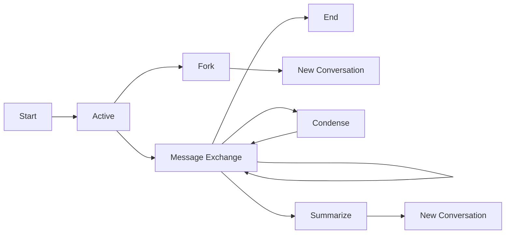

# Conversation Command

The `conversation` command provides **stateful**, multi-turn interactions with AI models. Conversations maintain context, history, and can be managed over time.

## Concept

Conversations enable complex, contextual interactions:
- **Stateful**: Maintains message history and context
- **Persistent**: Conversations are saved and can be resumed
- **Contextual**: AI remembers previous messages in the conversation
- **Manageable**: Full lifecycle management (start, pause, resume, end)
- **Advanced**: Support for forking, condensing, and summarizing

## Core Concepts

### Conversation Lifecycle



### Context Management

Conversations automatically collect and track:
- **Message History**: All user and AI messages
- **Token Usage**: Input, output, and total token consumption
- **Metadata**: Timestamps, provider info, model details
- **Statistics**: Message counts, character counts, conversation age

## Quick Start

### Auto-Start Feature (Recommended)

The easiest way to use conversations - they start automatically:

```bash
# Just send a message - conversation starts automatically!
npx anygpt conversation message "Help me design a REST API"

# Output:
🚀 No active conversation found. Starting a new one...
🎯 Started new conversation: openai/gpt-4o - 10/3/2025, 4:41:12 PM
📝 Conversation ID: conv_1759502472315_qqx8eocbt
🔄 openai/gpt-4o - 10/3/2025, 4:41:12 PM
👤 Help me design a REST API
🤖 I'd be happy to help you design a REST API! Let's start with the basics...
📊 Current: 8 input + 45 output = 53 tokens
📈 Total: 8 input + 45 output = 53 tokens
💬 Context: 1 messages (Chat API + local context)
```

### Manual Management

For more control, manage conversations explicitly:

```bash
# Start a named conversation
npx anygpt conversation start --name "API Design Session"

# Send messages
npx anygpt conversation message "What are REST principles?"
npx anygpt conversation message "How do I handle authentication?"

# End when done
npx anygpt conversation end
```

## Command Reference

### Core Commands

#### `start` - Create New Conversation

```bash
npx anygpt conversation start [options]
```

**Options:**
- `--provider <name>`: Provider from config (default: config default)
- `--model <model>`: Model name (default: config default)  
- `--name <name>`: Custom conversation name (default: auto-generated)

**Examples:**
```bash
# Basic start
npx anygpt conversation start

# Named conversation
npx anygpt conversation start --name "Code Review Session"

# Specific model
npx anygpt conversation start --model gpt-4o --name "Complex Analysis"
```

#### `message` - Send Message

```bash
npx anygpt conversation message [options] <message>
```

**Options:**
- `--conversation <id>`: Target specific conversation (default: current active)

**Examples:**
```bash
# Send to active conversation (auto-starts if none)
npx anygpt conversation message "Explain async patterns"

# Send to specific conversation
npx anygpt conversation message "Continue our discussion" --conversation conv_123
```

#### `end` - End Conversation

```bash
npx anygpt conversation end
```

Ends the current active conversation and clears the active state.

#### `list` - Show All Conversations

```bash
npx anygpt conversation list
```

Shows all conversations with metadata:
```bash
📋 Conversations:
├─ conv_123 - API Design Session (5 messages, 234 tokens)
├─ conv_456 - Code Review (12 messages, 1.2k tokens) [ACTIVE]
└─ conv_789 - Database Design (3 messages, 156 tokens)
```

### Advanced Commands

#### `fork` - Branch Conversation

Create a new conversation with the same history but different future:

```bash
npx anygpt conversation fork [options]
```

**Options:**
- `--conversation <id>`: Source conversation (default: current)
- `--name <name>`: Name for forked conversation
- `--model <model>`: Model for new conversation
- `--provider <provider>`: Provider for new conversation

**Use Cases:**
- **Explore alternatives**: Try different approaches to the same problem
- **A/B testing**: Compare different AI models on the same context
- **Branching discussions**: Take conversation in multiple directions

**Example:**
```bash
# Original conversation about database design
npx anygpt conversation message "Design a user authentication system"
npx anygpt conversation message "Should I use JWT or sessions?"

# Fork to explore JWT approach
npx anygpt conversation fork --name "JWT Implementation"
npx anygpt conversation message "Show me JWT implementation details"

# Switch back and fork for sessions approach  
npx anygpt conversation continue <original-id>
npx anygpt conversation fork --name "Session Implementation"
npx anygpt conversation message "Show me session-based auth implementation"
```

#### `condense` - Optimize Context

Reduce conversation length while preserving important context:

```bash
npx anygpt conversation condense [options]
```

**Options:**
- `--conversation <id>`: Target conversation (default: current)
- `--keep-recent <number>`: Recent messages to preserve (default: 3)
- `--dry-run`: Preview changes without applying

**How it works:**
1. Takes older messages (beyond `--keep-recent`)
2. Uses AI to create a summary of the conversation so far
3. Replaces old messages with the summary
4. Keeps recent messages for immediate context

**Use Cases:**
- **Long conversations**: Prevent context window overflow
- **Cost optimization**: Reduce token usage in subsequent messages
- **Performance**: Faster processing with condensed context

**Example:**
```bash
# Check current context size
npx anygpt conversation context

# Preview condensation
npx anygpt conversation condense --dry-run --keep-recent 5

# Apply condensation
npx anygpt conversation condense --keep-recent 5
```

#### `summarize` - Create Summary Branch

Create a new conversation with an AI-generated summary of the current one:

```bash
npx anygpt conversation summarize [options]
```

**Options:**
- `--conversation <id>`: Source conversation (default: current)
- `--keep-recent <number>`: Recent messages to include (default: 3)
- `--name <name>`: Name for new conversation
- `--model <model>`: Model for new conversation
- `--provider <provider>`: Provider for new conversation
- `--dry-run`: Preview summary without creating conversation

**Difference from Fork:**
- **Fork**: Copies exact message history
- **Summarize**: Creates AI-generated summary + recent messages

**Use Cases:**
- **Meeting notes**: Summarize long discussions
- **Project handoffs**: Create concise context for new team members
- **Documentation**: Generate summaries for later reference

**Example:**
```bash
# Long technical discussion about microservices
# ... many messages ...

# Create summary for handoff
npx anygpt conversation summarize --name "Microservices Architecture Summary"
```

### Information Commands

#### `show` - Display Full History

```bash
npx anygpt conversation show [options]
```

**Options:**
- `--conversation <id>`: Target conversation (default: current)

Shows complete conversation history with timestamps and metadata.

#### `context` - Analyze Context Statistics

```bash
npx anygpt conversation context [options]
```

**Options:**
- `--conversation <id>`: Target conversation (default: current)

**Sample Output:**
```bash
📊 Context Statistics for: openai/gpt-4o - 10/3/2025, 4:41:12 PM
🆔 ID: conv_1759502472315_qqx8eocbt
🤖 Provider: openai/gpt-4o

💬 Messages:
   Total: 12
   👤 User: 6
   🤖 Assistant: 6

🎯 Token Usage:
   Input tokens: 1,234
   Output tokens: 2,456
   Total tokens: 3,690
   Estimated context: ~1,845 tokens

📝 Content Analysis:
   Total characters: 15,678
   Average message: 1,306 characters
   Longest message: 3,245 characters
   Shortest message: 12 characters

⏰ Timeline:
   Conversation age: 2 hours 15 minutes
   Last activity: 5 minutes ago
   Created: 10/3/2025, 2:26:12 PM
   Updated: 10/3/2025, 4:36:45 PM

💡 Optimization Suggestions:
   - Consider condensing: conversation is getting long
   - Recent activity: conversation is active
   - Token efficiency: 67% (good)
```

#### `continue` - Resume Specific Conversation

```bash
npx anygpt conversation continue <id>
```

Sets the specified conversation as active for subsequent `message` commands.

#### `delete` - Remove Conversation

```bash
npx anygpt conversation delete <id>
```

Permanently deletes a conversation and all its history.

## Context Collection & Metrics

### What Gets Tracked

Conversations automatically collect comprehensive metrics:

#### Message Metrics
- **Count**: Total messages, user messages, assistant messages
- **Content**: Character counts, message lengths
- **Timing**: Creation time, last update, conversation age

#### Token Metrics  
- **Input tokens**: Cumulative tokens sent to AI
- **Output tokens**: Cumulative tokens received from AI
- **Total tokens**: Sum of input + output
- **Estimated context**: Approximate tokens in current context window

#### Usage Patterns
- **Activity**: Last activity timestamp, conversation age
- **Efficiency**: Token usage patterns, message frequency
- **Optimization**: Suggestions for condensing or summarizing

### How Metrics Are Used

#### Cost Management
```bash
# Check token usage before expensive operations
npx anygpt conversation context

# If tokens are high, consider condensing
npx anygpt conversation condense --keep-recent 3
```

#### Performance Optimization
```bash
# Long conversations may hit context limits
# Use context command to monitor size
npx anygpt conversation context

# Condense when approaching limits
npx anygpt conversation condense
```

#### Conversation Management
```bash
# List conversations with usage stats
npx anygpt conversation list

# Focus on high-value conversations
# Archive or delete unused ones
npx anygpt conversation delete conv_old_123
```

## Comparison: Chat vs Conversation

| Aspect | Chat | Conversation |
|--------|------|--------------|
| **State** | Stateless | Stateful |
| **Memory** | None | Full history |
| **Context** | Single message | Cumulative |
| **Storage** | None | Persistent |
| **Use Case** | Quick questions | Extended discussions |
| **Token Usage** | Per message | Cumulative |
| **Management** | None needed | Full lifecycle |
| **Advanced Features** | None | Fork, condense, summarize |

### When to Use Each

#### Use Chat For:
- Quick factual questions
- One-off code snippets  
- Simple translations
- Independent tasks
- Automation/scripting

#### Use Conversation For:
- Code reviews
- Architecture discussions
- Learning sessions
- Iterative development
- Complex problem solving
- Multi-step tutorials

## Best Practices

### 1. Conversation Naming

```bash
# Good: Descriptive names
npx anygpt conversation start --name "React Performance Optimization"
npx anygpt conversation start --name "Database Schema Review - User Service"

# Less helpful: Generic names
npx anygpt conversation start --name "Chat"
npx anygpt conversation start --name "Work"
```

### 2. Context Management

```bash
# Monitor context size regularly
npx anygpt conversation context

# Condense when conversations get long (>2000 tokens)
npx anygpt conversation condense --keep-recent 5

# Use dry-run to preview changes
npx anygpt conversation condense --dry-run
```

### 3. Forking Strategies

```bash
# Fork before exploring alternatives
npx anygpt conversation message "How should I implement caching?"
# AI suggests Redis and Memcached

# Fork to explore Redis
npx anygpt conversation fork --name "Redis Implementation"
npx anygpt conversation message "Show Redis implementation details"

# Continue original to explore Memcached
npx anygpt conversation continue <original-id>
npx anygpt conversation fork --name "Memcached Implementation"  
npx anygpt conversation message "Show Memcached implementation details"
```

### 4. Summarization Workflow

```bash
# Long design session
npx anygpt conversation start --name "Microservices Architecture Design"
# ... many messages discussing services, databases, APIs ...

# Create summary for team review
npx anygpt conversation summarize --name "Architecture Summary for Review"

# Continue detailed work in original
npx anygpt conversation continue <original-id>
npx anygpt conversation message "Let's dive deeper into the user service"
```

## Error Handling

### Common Issues

#### No Active Conversation
```bash
Error: No active conversation. Use --conversation <id> or start a conversation first.
```
**Solution**: This is now handled automatically with auto-start feature.

#### Conversation Not Found
```bash
Error: Conversation 'conv_123' not found
```
**Solution**: Use `npx anygpt conversation list` to see available conversations.

#### Context Too Large
```bash
Warning: Conversation context is very large (>4000 tokens)
```
**Solution**: Use `npx anygpt conversation condense` to reduce context size.

## Integration Examples

### Development Workflow

```bash
# Start coding session
npx anygpt conversation start --name "Feature: User Authentication"

# Design phase
npx anygpt conversation message "Design JWT authentication flow"
npx anygpt conversation message "What security considerations should I include?"

# Implementation phase  
npx anygpt conversation message "Show me the JWT middleware implementation"
npx anygpt conversation message "How do I handle token refresh?"

# Review phase
npx anygpt conversation message "Review this authentication code: [paste code]"

# Fork for alternative approach
npx anygpt conversation fork --name "OAuth Implementation Alternative"
npx anygpt conversation message "Show OAuth 2.0 implementation instead"
```

### Learning Session

```bash
# Start learning
npx anygpt conversation start --name "Learning: Advanced TypeScript"

# Progressive learning
npx anygpt conversation message "Explain TypeScript generics"
npx anygpt conversation message "Show me practical examples"
npx anygpt conversation message "How do conditional types work?"
npx anygpt conversation message "Can you give me exercises to practice?"

# Create summary for later review
npx anygpt conversation summarize --name "TypeScript Generics Summary"
```

The conversation system provides powerful tools for managing complex, contextual interactions with AI models, enabling sophisticated workflows that go far beyond simple question-and-answer patterns.
